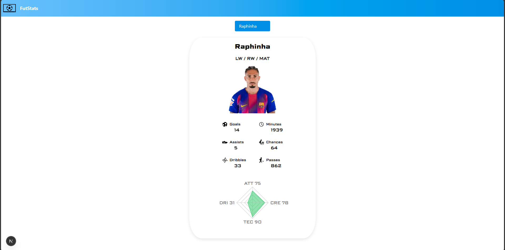
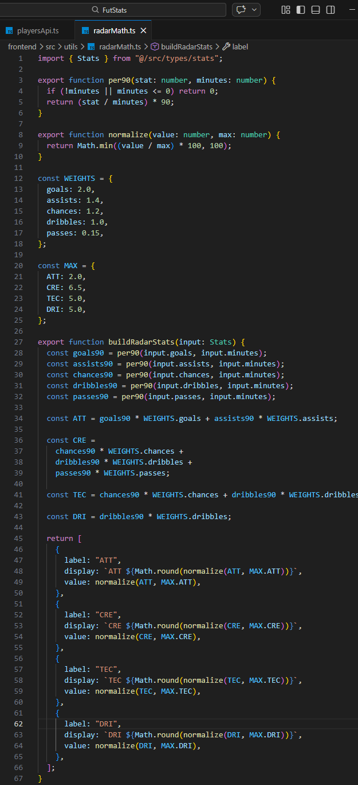

# FutStats

A football stats web application focused on comparing players through a clear, structured, and visual presentation of performance data.  
This project was built as a study-driven application, with special attention to front-end organization, data handling, and custom stat scoring logic.

---

## Overview

**FutStats** was created to display and compare football player statistics in a more practical way.  
The main idea of the project is to fetch raw player data, process it on the application side, and convert it into a more readable and comparable format for the user.
This project was also an opportunity to practice:

- Component-based architecture
- TypeScript organization
- Separation of responsibilities
- Data transformation before rendering
- Conditional rendering
- Custom business logic for player evaluation

  

---

## Main Goal

The main goal of this project is learning about system architecture, working with robust frameworks, and consuming data from external APIs.

## How the Statistics Scoring Logic Works

One of the core parts of this project is the logic used to assign points to player statistics.

Instead of only displaying raw numbers, the application uses a custom rule system to interpret those values and convert them into a scoring model.  
This makes the comparison more meaningful, because each statistical category can contribute differently depending on its importance in the analysis.

The scoring flow follows this kind of reasoning:

1. A statistical value is received from the API
2. The application checks that value against predefined conditions or ranges
3. Based on the result, a certain number of points is assigned
4. These points are then used to help represent the player's performance profile

  

---

## Technologies

  
  
  
  

